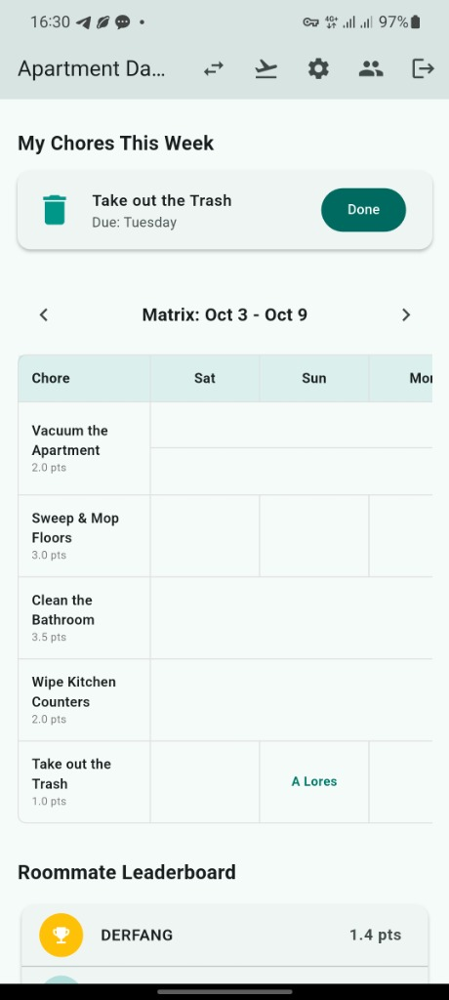
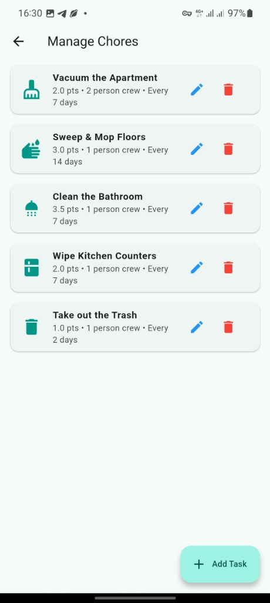
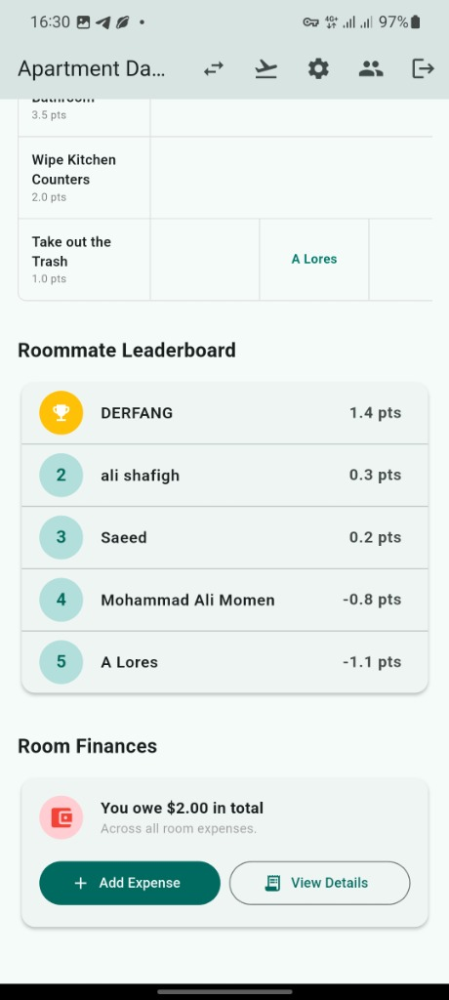
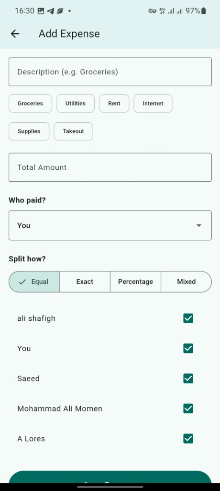

# 🏠 Roommate Chores & Expense Manager

A modern, cross-platform Flutter application designed to eliminate shared apartment friction. Automate chore rotations with a fair point system, track shared expenses with flexible splitting options, and keep everyone accountable with real-time leaderboards.

---

## ✨ Key Features

### 📅 Fair Chore Matrix & Task Rotation
Never argue about whose turn it is to take out the trash again. 
- **Effort-Based Points:** Assign custom point values to chores based on difficulty (e.g. 3.5 pts for deep-cleaning the bathroom vs. 1.0 pt for trash).
- **Custom Frequencies & Crew Sizes:** Schedule tasks every $N$ days with single or multi-person crews.
- **Weekly Schedule Matrix:** Clear day-by-day timetable showing assigned chores for the current week.

  
  &nbsp;&nbsp;
  

---

### 🏆 Roommate Leaderboard
Keep apartment tasks engaging and transparent:
- Points are awarded automatically when tasks are completed.
- Live ranking highlights top contributors and helps rebalance duties fairly.

---

### 💰 Room Finances & Split Expenses
Track apartment purchases without needing third-party spreadsheets:
- **Categorized Spending:** Quickly log expenses for Groceries, Utilities, Rent, Internet, Household Supplies, or Takeout.
- **Flexible Splitting:** Split bills **Equally**, by **Exact Amount**, by **Percentage**, or using **Mixed** customized rules.
- **Instant Balances:** Immediate calculation of who paid, who owes what, and net roommate balances.

  
  &nbsp;&nbsp;
  

---

### 🚀 Built with Modern Technology
- **Flutter & Dart:** Smooth, responsive cross-platform UI for Android and Windows.
- **Firebase Firestore:** Real-time cloud synchronization, multi-user concurrency, and offline persistence.
- **Automated CI/CD:** GitHub Actions workflows building optimized Android split APKs and Windows releases on every version tag.

---

## 📲 Downloads & Installation

Pre-built binaries are generated automatically via GitHub Releases for every version tag:

- **Android:** Optimized per-architecture APKs (`arm64-v8a`, `armeabi-v7a`, `x86_64`).
- **Windows:** Portable ZIP archive containing the standalone desktop executable.

Check the [Releases](https://github.com/derfang/Anbari_manager/releases) tab to download the latest version.
